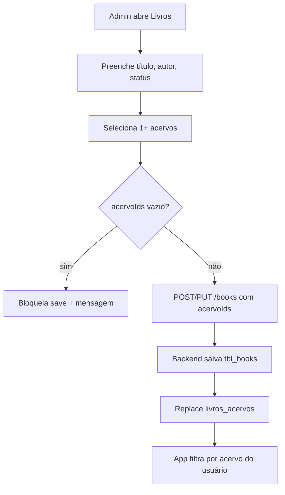

sim# Acervos — design para cadastro de livros por escola

**Data:** 2026-06-16  
**Status:** Aguardando aprovação  
**Escopo:** Admin React + backend Kotlin (MySQL legado)

## Problema

No legado, cada escola/equipamento tem um **acervo** (biblioteca digital). Livros só aparecem no app se estiverem vinculados ao acervo via `livros_acervos`. Usuários têm `acervo_id` fixo. O admin moderno não expõe acervos — cadastro de livro fica incompleto.

## Premissa (opção A)

- **Acervo = biblioteca da escola** (sem entidade Escola separada por agora).
- Um livro pode estar em **vários acervos** (N:N).
- Um usuário pertence a **um** acervo.
- Regra legada mantida: **livro sem acervo não aparece para ninguém no app**.

## Abordagens consideradas

| Abordagem | Descrição | Prós | Contras |
|-----------|-----------|------|---------|
| **1 — Legado direto (recomendada)** | JPA nas tabelas `acervos` + `livros_acervos` existentes | Rápido, compatível com API/app atual | Nomenclatura legada no código |
| **2 — Schema core novo** | `catalog_collections` no estilo Postgres | Modelo limpo longo prazo | Duplicação/sync com MySQL até migração |
| **3 — Só vínculo em livro** | Endpoint de opções, CRUD no PHP | Mínimo esforço | Fluxo fragmentado, UX ruim |

**Recomendação:** Fase 1 com abordagem 1. Na migração Postgres, mapear para tabelas `catalog_collections` (fase futura).

---

## Arquitetura

### Modelo de dados (MySQL existente)

```
acervos (id, nome, descricao, status, created_at)
livros_acervos (id, book_id, acervo_id)  UNIQUE(book_id, acervo_id)
tbl_users.acervo_id → acervos.id
```

### Backend — módulo `catalog` (ou `acervo`)

**Entidades JPA**

- `AcervoEntity` → `acervos`
- `LivroAcervoEntity` → `livros_acervos` (sem expor CRUD direto; gerido pelos use cases de livro)

**API REST** (`/api/v1/acervos`)

| Método | Rota | Descrição |
|--------|------|-----------|
| GET | `/acervos` | Lista (nome, status, contadores livros/usuários) |
| GET | `/acervos/options` | `{ id, name }` para selects |
| GET | `/acervos/{id}` | Detalhe |
| POST | `/acervos` | Criar |
| PUT | `/acervos/{id}` | Atualizar |
| DELETE | `/acervos/{id}` | Soft: `status = 0` (não apagar se tiver usuários ativos — validar) |

**Alterações em livros**

- `UpsertBookRequest`: campo `acervoIds: List<Long>` (obrigatório, min 1).
- `BookResponse`: `acervoIds: List<Long>`, `acervoNames: List<String>` (ou `acervos: [{id, name}]`).
- `CreateBookUseCase` / `UpdateBookUseCase`: após salvar livro, **replace** vínculos em `livros_acervos` (delete + insert em transação).
- `ListBooksUseCase`: JOIN opcional para retornar acervos; filtro query `?acervoId=` na listagem.

**Validações**

- `acervoIds` não vazio ao criar/editar livro.
- IDs devem existir e `status = 1`.
- Nome de acervo único (como no PHP).
- Ao desativar acervo: avisar se ainda há usuários vinculados (não bloquear na v1, só warning na UI).

### Frontend

**Navegação** — grupo Catálogo:

- Novo item **Acervos** (`/acervos`) com ícone `Library` ou `Building2`.

**Página AcervosPage** (padrão AuthorsPage / UsersPage)

- Listagem com busca, status, colunas: nome, livros, usuários, status.
- Formulário: nome, descrição (textarea), status.
- Modal de detalhe ao clicar na linha.

**BooksPage / BooksForm**

- Campo **multi-select** “Acervos” (obrigatório), carregado de `/acervos/options`.
- Texto de ajuda: *“Selecione em quais acervos o livro ficará disponível. Sem acervo, o livro não aparece no app.”*
- Ao editar: pré-selecionar acervos atuais.
- Filtro na listagem: dropdown “Filtrar por acervo”.
- `BookDetailModal`: chips com nomes dos acervos.

**Fase 2 (fora do MVP)**

- `UsersPage`: select de acervo no cadastro/edição.
- Dashboard: métricas por acervo.

### Fluxo de cadastro de livro (refinado)



### Erros e edge cases

- Acervo desativado mas ainda em livro antigo: exibir aviso no form, permitir salvar se admin mantiver vínculo.
- Livro legado sem acervo: listagem mostra badge “Sem acervo”; editar força seleção.
- Delete acervo: preferir soft delete (`status=0`); hard delete só se sem livros e sem usuários.

### Testes manuais

1. Criar acervo → aparece em options.
2. Criar livro com 2 acervos → `livros_acervos` com 2 linhas.
3. Editar livro trocando acervos → vínculos antigos removidos.
4. Filtrar listagem por acervo.
5. Usuário com `acervo_id=1` vê livro no app apenas se vinculado ao acervo 1 (validação via API legada ou smoke).

### Fora de escopo (v1)

- Entidade Escola com múltiplos acervos.
- Permissões por acervo (admin vê só sua escola).
- Migração Postgres `catalog_collections` (ticket separado).
- Importação em massa livro↔acervo.

---

## Ordem de implementação

1. Backend: entidades + repositório + CRUD acervos + options.
2. Backend: `acervoIds` em create/update/list books.
3. Frontend: types, service, queries, AcervosPage.
4. Frontend: multi-select e filtro em BooksPage + modal.
5. Smoke manual + ajustes de copy/validação.

## Aprovação

- [x] Usuário aprovou escopo MVP (acervos CRUD + vínculo em livros)
- [x] Fase 2 (usuários) — campo acervo em listagem, filtro e modal de edição

## Implementação (2026-06-16)

- Backend: `AcervoController`, entidades `acervos`/`livros_acervos`, sync em create/update de livros
- Frontend: `AcervosPage`, multi-select em livros, filtro por acervo, modal de detalhe
